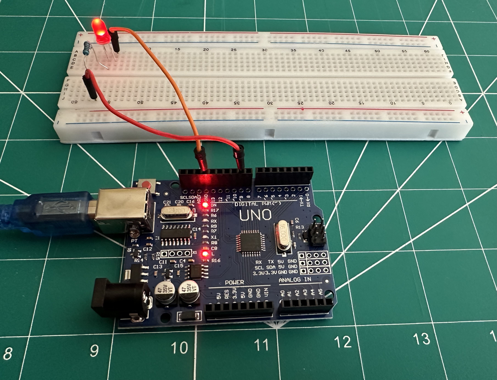
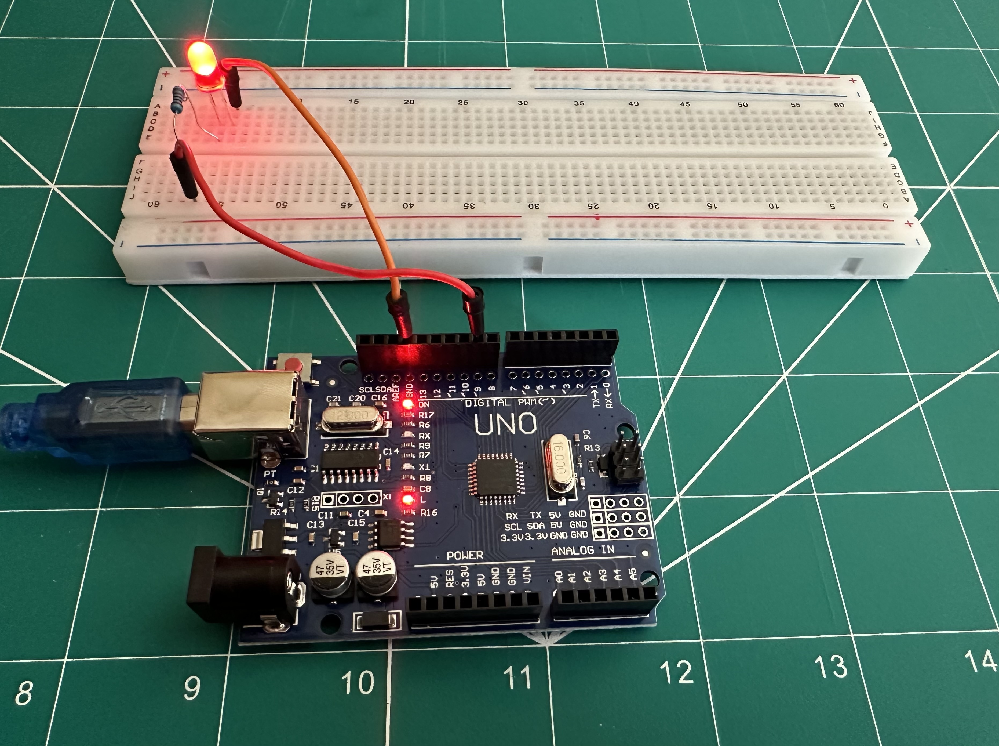

# Arduino Uno Project: Dual Pin (Digital & Analog) Control

## Overview
This project demonstrates the use of a single pin in an Arduino Uno (Pin 9 in this case) to function both as a digital and analog output. By controlling the voltage output on Pin 9, we can modulate an LED's brightness between two different levels: **high voltage** (full brightness) and **low voltage** (dimmed brightness).

### Features:
- Controls the brightness of an LED using **Pulse Width Modulation (PWM)**.
- Toggles between **high** and **low** voltages every second, changing the brightness level of the connected LED.
  
## Images

1. **Low Voltage:** A dimly lit LED, representing the lower brightness level.

2. **High Voltage:** A brightly lit LED, representing the higher brightness level.

## Requirements
- Arduino Uno
- LED
- Resistor (220Ω recommended)
- Breadboard & jumper wires

